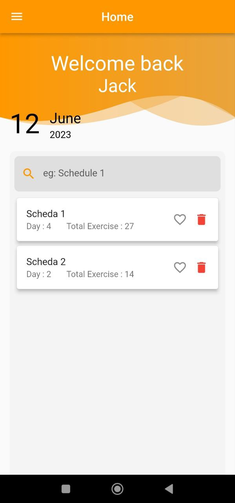
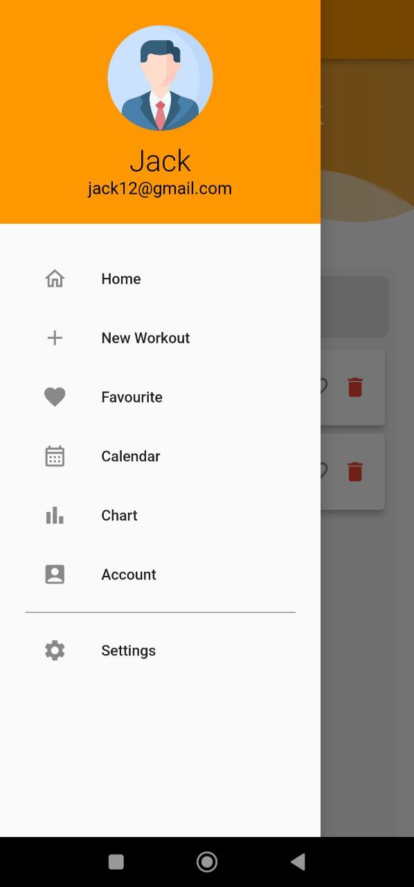
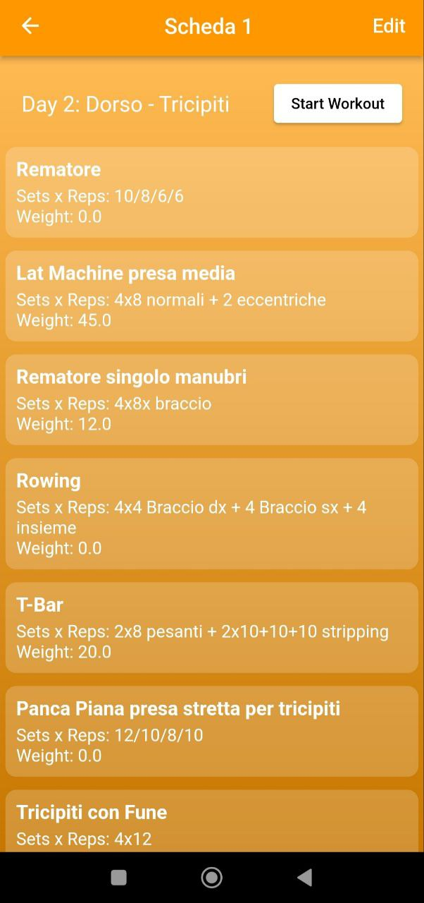
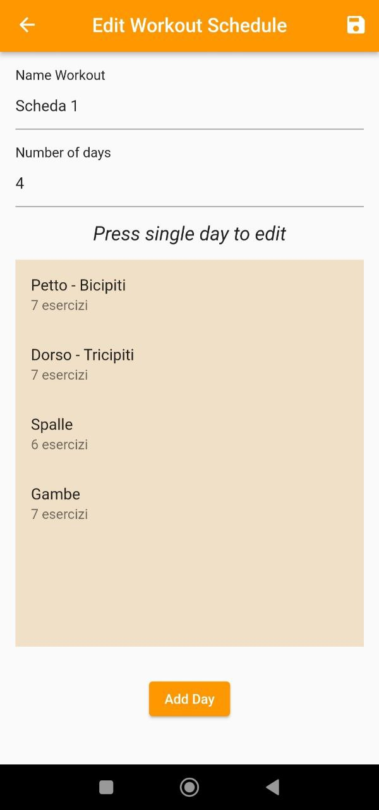
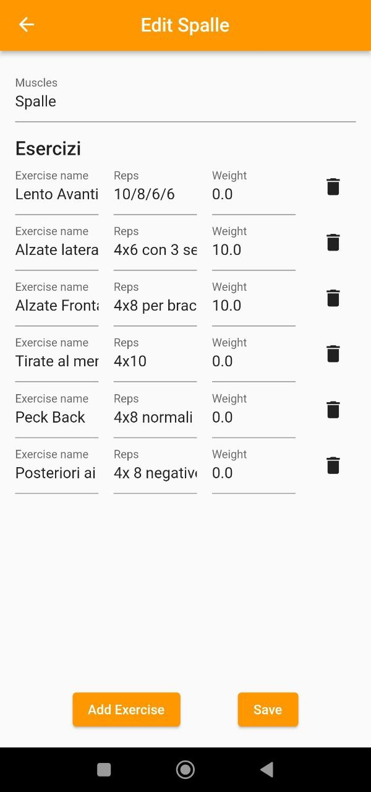
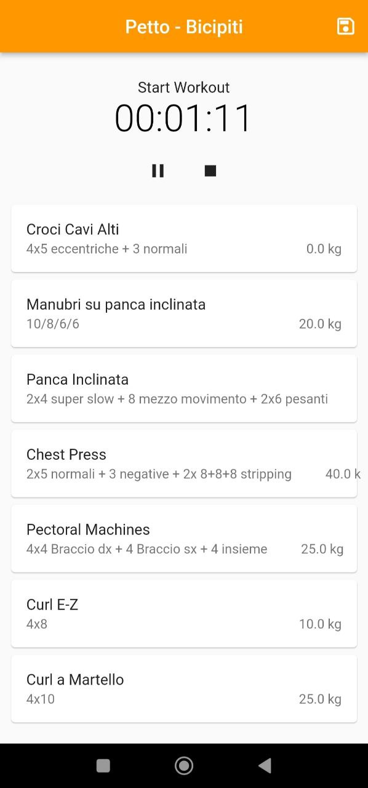
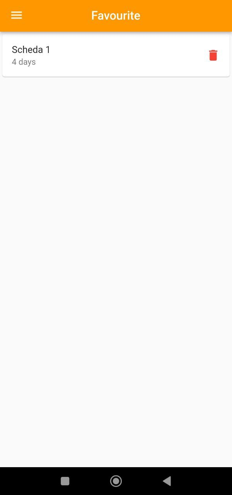
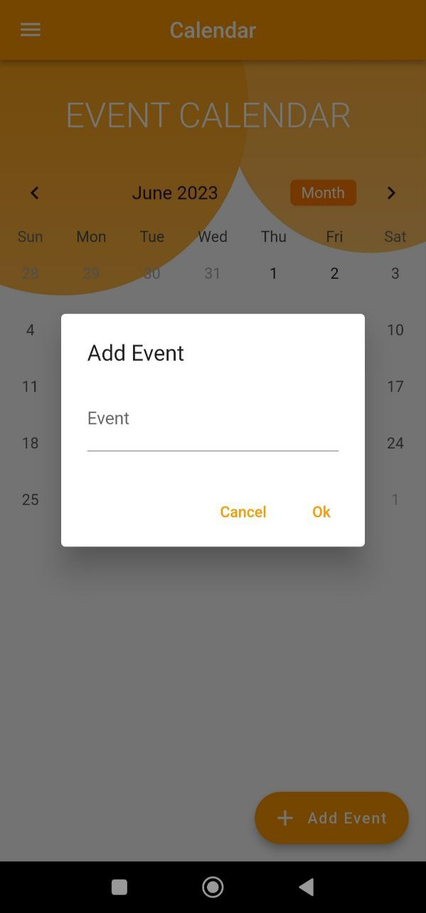
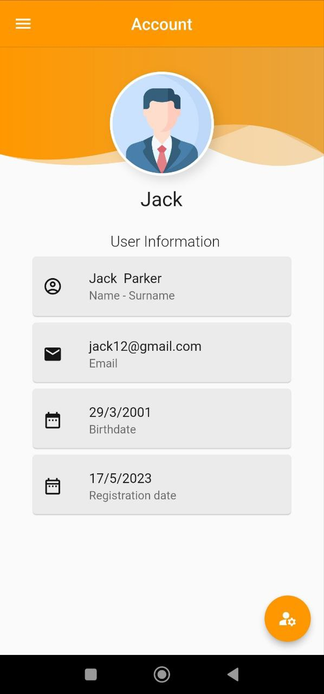

# F_GymApp

## Description
Hybrid App developed in Flutter and allows you to mark the training schedules within it, 
in such a way as to be able to keep and update all the Gym training schedules quickly and easily. 
Inside, the application allows you to mark the cards, edit them, see them, start a specific workout and much more.

## Application photo
 

  
  
  

 
 

  
  
  

 
 

  
  
                                                                                   

 
 

  
  
                                                                                   

 
 

## Installation guide
See the description of the repository at the following link : 
 

https://github.com/DiscoHub12/F_Expense_App

where there is the guide to install the application.
