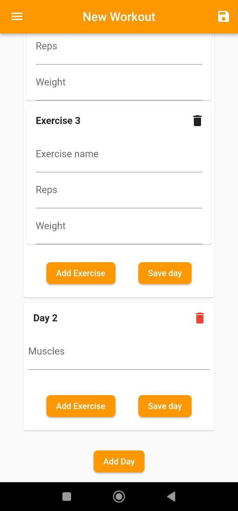
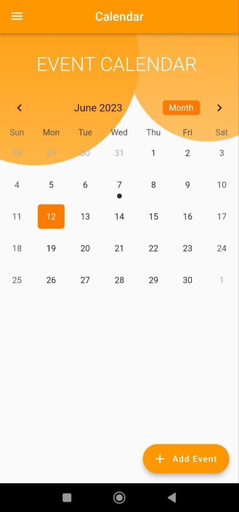

# F_GymApp

## Description
Hybrid App developed in Flutter and allows you to mark the training schedules within it, 
in such a way as to be able to keep and update all the Gym training schedules quickly and easily. 
Inside, the application allows you to mark the cards, edit them, see them, start a specific workout and much more.

## Application photo
 

  
  
  

 
 

  
  
  

 
 

  
  
                                                                                   

 
 

  
  
                                                                                   

 
 

## Installation guide
On the left, under the "Release" section, press the only available tag. 
 
Inside the tag, go to the v1.0.0 section and download the APK.
 
At the moment, the application is in Beta development, and for the moment there is only an Android Beta version.
